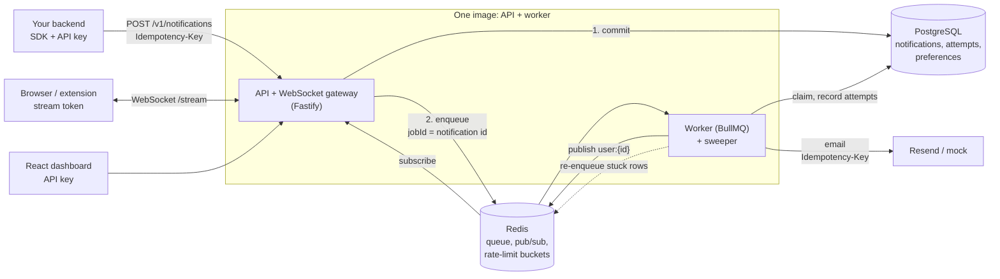
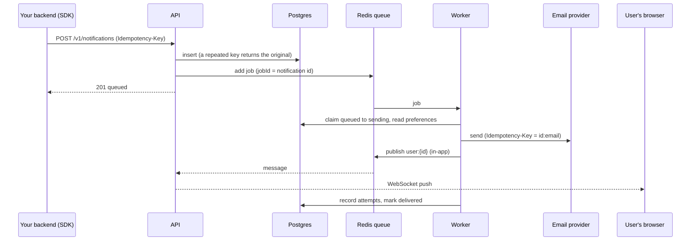

# Real-Time Notification Service

A small, self-hostable notification service in the spirit of Knock or OneSignal. Other apps call its API to notify their users over **email** and **in-app real-time (WebSocket)**, with a durable inbox, retries and a dead-letter set, idempotency, per-tenant rate limiting, user preferences (opt-outs, quiet hours), digests, and a dashboard. Built with Node.js, TypeScript, Fastify, PostgreSQL, Redis and BullMQ.

## Architecture



Postgres is the source of truth; Redis carries work and live messages and can be lost without losing a notification, because the sweeper rebuilds the queue from Postgres. The API and worker can run as one process (the Render free-tier setup) or as separate processes.

### Life of a notification



Failures take a different path: a transient error returns the notification to `queued` and BullMQ retries with exponential backoff; a permanent error or the fifth failed attempt moves it to `failed` (the dead-letter set), from where it can be replayed. See [Reliability](#reliability) and [docs/DECISIONS.md](docs/DECISIONS.md).

## Requirements

- Node.js 20+
- Docker Compose

## Local setup

```sh
docker compose up -d
cp .env.example .env
npm install
npm run db:migrate
npm run provision:tenant -- "My first app"
npm run dev
```

Provisioning prints a one-time `ntf_live_...` key. Save it securely; the database stores only its SHA-256 hash. The API currently accepts `POST /v1/notifications` with `Authorization: Bearer <key>` and JSON `{ "userId": "<tenant user UUID>", "type": "reminder", "payload": {} }`.

Create or update tenant users with `PUT /v1/users/:externalUserId` and `{ "email": "person@example.com" }`. Templates are created with `POST /v1/templates` using `{ "name": "welcome", "subject": "Hi {{name}}", "body": "<p>Hello {{name}}</p>", "variables": ["name"] }`; `GET /v1/templates` lists only the authenticated tenant's templates. A notification may specify `templateName` and `variables` in addition to `userId`, `type`, and `payload`. Missing required template variables return `422`; HTML body substitutions are escaped.

Run `npm run dev` for the API and `npm run worker` in a second terminal. Redis and PostgreSQL are provided by `docker compose up -d`. The default email channel is a mock. Set `EMAIL_PROVIDER=resend`, `RESEND_API_KEY`, and `EMAIL_FROM` in `.env` to enable Resend. Tests use the mock channel.

```sh
npm run lint
npm test
npm run build
```

## Real-time delivery and inbox

Add `"channels": ["in_app"]` (or `["email", "in_app"]`; default `["email"]`) to a notification to deliver it in-app. The notification row is the durable inbox entry; the worker also publishes it over Redis pub/sub so every API instance can push it to that user's open sockets.

1. Set `STREAM_TOKEN_SECRET` (32+ chars) in `.env`.
2. Your backend mints a one-hour token for its end user: `POST /v1/users/:externalUserId/stream-token` with the API key returns `{ "token", "expiresAt" }`.
3. The browser opens `ws://host/stream?token=...`. It first receives `{type:"inbox", notifications:[...]}` (latest 50, newest first, including `readAt`) and then `{type:"notification", notification:{...}}` live. Send `{type:"read", id}` to mark one read; the reply is `{type:"read", id, ok}`.
4. Backends can also use `GET /v1/users/:externalUserId/inbox` and `POST /v1/users/:externalUserId/inbox/:id/read` (204).

Open `/demo` in a browser, paste a token, and send notifications to watch them appear live and survive a refresh. The token is in the query string, so request logs redact it.

## API response

Successful creation returns `201` with `id`, `status: "queued"`, and `createdAt`. Errors use `{ "error": { "code": "...", "message": "..." } }`; malformed input returns `400`, missing/invalid credentials `401`, and a user not found within the tenant `422`.

## Client SDK

`sdk/` is a zero-dependency TypeScript client: a server-side `NotificationClient` (retries safely using idempotency keys) and a browser `NotificationStream` (live notifications with inbox replay and reconnects). `POST /v1/notifications` accepts `externalUserId` (your own user id) instead of the internal `userId`. See [sdk/README.md](sdk/README.md).

## Preferences, quiet hours and digests

- `GET/PUT /v1/users/:externalUserId/preferences`. PUT replaces the whole set: `{ "preferences": [{ "channel": "email", "type": "promo", "enabled": false }, { "channel": "*", "type": "*", "quietHours": { "start": "22:00", "end": "07:00", "timezone": "Asia/Kolkata" } }] }`. `channel` is `email`, `in_app` or `*`; `type` is a notification type or `*`. The most specific row decides `enabled`; quiet hours come from the most specific row that defines them.
- An opted-out channel is skipped (recorded as a `skipped` attempt). If nothing was delivered the notification ends as `suppressed`.
- **Quiet hours delay, they never drop:** during the window the notification waits (status `queued`, `deliverAfter` set) and is delivered when the window ends. Opted-out channels are not delayed, they are skipped.
- **Digests:** add `"digestKey": "comments:post-42"` (and optionally `"digestWindowSeconds"`, 10 to 86400, default 300) to a notification. The first one waits out the window; every other notification for that user and key that arrives meanwhile is absorbed (`batched`) and one combined notification goes out ("3 new comment notifications", or your template with an extra `{{count}}` variable). In-app inbox items carry `count`. A lone notification is sent normally.

## Dashboard API

`GET /v1/stats?hours=24` (counts by status and by channel/attempt status), `GET /v1/notifications?status=&limit=&before=` (log, newest first, `nextBefore` cursor), and API keys: `GET /v1/api-keys`, `POST /v1/api-keys` (returns the plaintext key once), `DELETE /v1/api-keys/:id` (`409` for the last active key). Plus the dead-letter endpoints below.

## Dashboard

A React dashboard (overview counts, notification log with per-attempt detail and replay, dead letters, API key management) lives in `dashboard/`. Build it with `npm run dashboard:build`; the API then serves it at `http://localhost:3000/dashboard/`. Sign in by pasting a tenant API key; it is kept in that browser tab only. For development, `npm --prefix dashboard run dev` serves it with hot reload and proxies `/v1` to the API on port 3000.

## Reliability

**Delivery guarantee: at-least-once processing, effectively-once delivery.** A notification is never dropped by a crash, restart or provider outage, and a crash can at worst cause a repeat *attempt*, which is deduplicated so the recipient sees it once. Three layers provide this:

1. **Claim and skip:** the worker claims a notification (`queued`/`sending` to `sending`) and records a `sent` attempt per channel. Retries and crash redeliveries skip channels already sent.
2. **Provider idempotency key:** every email is sent with `Idempotency-Key: <notificationId>:email`, so a crash between "provider accepted" and "we recorded it" cannot produce a second email on providers that honour the header (Resend does, for 24 hours). In-app items are keyed by notification id, which the client dedupes on.
3. **Idempotent API:** send `Idempotency-Key: <your key>` on `POST /v1/notifications`. A repeated call returns the original notification with `200` and `Idempotent-Replayed: true`; the same key with a different body returns `422 IDEMPOTENCY_KEY_REUSED`.

**Retries:** transient failures are retried up to 5 attempts with exponential backoff (1s, 2s, 4s, ...) and 50% jitter. Permanent failures (no recipient email, missing template, provider 4xx other than 408/429) skip retries.

**Dead letters:** a notification that fails permanently or exhausts its attempts ends as `failed`. `GET /v1/dead-letters` lists them, `GET /v1/notifications/:id` shows status and every delivery attempt with its error, and `POST /v1/notifications/:id/replay` re-queues one (`202`; `409` if it is not failed).

**Crashes and the enqueue gap:** a killed worker's job is redelivered by BullMQ after its lock expires, and the next worker takes over the half-sent notification. Notifications committed but never enqueued (the `503` case, or lost Redis data) are re-enqueued by a sweeper that runs in every worker (`queued`/`sending` and untouched for 60s; re-adding is a no-op while a job is live). Workers shut down gracefully on SIGTERM, finishing in-flight jobs first.

**Rate limiting:** each tenant has a Redis token bucket (`RATE_LIMIT_PER_MINUTE`, `RATE_LIMIT_BURST`) shared by all API instances. Over the limit returns `429` with `Retry-After`. If Redis is unreachable the limiter fails open.

`tests/chaos.integration.test.ts` kills a real worker process mid-send with 20 notifications in flight and asserts all 20 are delivered, none lost, none sent twice.

## Benchmarks

What was measured, how, and what it does **not** show. The k6 script is [loadtest/notifications.js](loadtest/notifications.js) and the whole procedure is [loadtest/run-local.sh](loadtest/run-local.sh), so every number below can be reproduced.

**Method.** The production Docker image runs API and worker in one process, as on Render (`RUN_WORKER=true`, concurrency 10), against a throwaway Postgres database and Redis in Docker. k6 sends `POST /v1/notifications` at a fixed arrival rate for 60 seconds (each notification goes to email and in-app, using the mock email channel so no provider is hit), then waits until every notification is delivered. "Accepted" means the API returned `201`. "Delivered" is counted from Postgres.

**Hardware.** Intel Core i7-12700H laptop (14 cores, 20 threads), 15.7 GB RAM, Windows 11, Docker Desktop (20 vCPUs, 8 GB). The app container was either uncapped or limited to `--cpus=0.1 --memory=512m`, which is Render's free instance size. Postgres and Redis were uncapped containers on the same machine, so there is no network latency between them and the app.

| Container | Arrival rate | Accepted / delivered | Lost or failed | API p95 latency | Notes |
|---|---|---|---|---|---|
| uncapped | 100/s (6,000/min) | 6,000 / 6,000 | 0 | 15 ms | kept up |
| uncapped | 200/s (12,000/min) | 12,001 / 12,001 | 0 | 18 ms | kept up |
| uncapped | 300/s (18,000/min) | 18,001 / 18,001 | 0 | 24 ms | kept up; ceiling not reached |
| 0.1 CPU, 512 MB | 10/s (600/min) | 600 / 600 | 0 | 879 ms | |
| 0.1 CPU, 512 MB | 20/s (1,200/min) | 1,201 / 1,201 | 0 | 1.46 s | everything delivered by the end of the run |
| 0.1 CPU, 512 MB | 40/s (2,400/min) | 2,242 / 2,242 (of 2,400 offered) | 0 | 5.5 s | overloaded: only 2,242 of the 2,400 offered requests were sent (cause not investigated), and the queue took until 128 s to drain |

**What this shows.**
- On an unconstrained machine one process sustained **18,000 notifications per minute** end to end with a 24 ms p95 and nothing lost. The test never found its limit; the load generator shares the same machine.
- On a Render-free-sized CPU allocation the system handles about **1,000 notifications per minute** (roughly 17 per second) before latency degrades, with API and worker sharing that one 0.1 CPU. Overload showed up as latency and a slower drain, **never as lost or failed notifications**.
- The crash test in [tests/chaos.integration.test.ts](tests/chaos.integration.test.ts) separately shows no loss or duplication when a worker is killed mid-send.

**What it does not show.**
- It is not a measurement of a real Render instance. The 0.1 CPU container is an emulation, Render's free instances are also throttled and may have noisy neighbours, and Postgres and Redis there are separate hosts. Expect worse numbers on Render; measure there before quoting any.
- "5,000 notifications per minute on a free-tier instance" is **not** supported by these results. That rate needed more than the 0.1 CPU allocation.
- The mock email channel is instant. Against a real provider, throughput is bounded by the provider's latency and rate limits (raise `WORKER_CONCURRENCY` to compensate).
- Single run per row, 60 seconds each; no confidence intervals.

## Deploying

A Render Blueprint ([render.yaml](render.yaml)) and a guide with the free-tier limits are in [docs/DEPLOY.md](docs/DEPLOY.md). `GET /ready` checks Postgres and Redis, and `GET /metrics` exposes Prometheus metrics (token-protected).

## Known limitations

- Exactly-once delivery is not claimed. A provider without idempotency keys could repeat an email after a crash in the window between acceptance and our record; this is the usual at-least-once trade-off.
- Retries are per notification, not per channel: a failing channel is retried alongside the others, but channels that already succeeded are skipped.
- Stream gateways have no heartbeat or per-connection limit yet, and stream tokens cannot be revoked before they expire.
- Notifications are committed before enqueueing; if enqueueing fails the API returns `503` with the saved ID, and the client's retry (same Idempotency-Key) or the sweeper recovers it.
